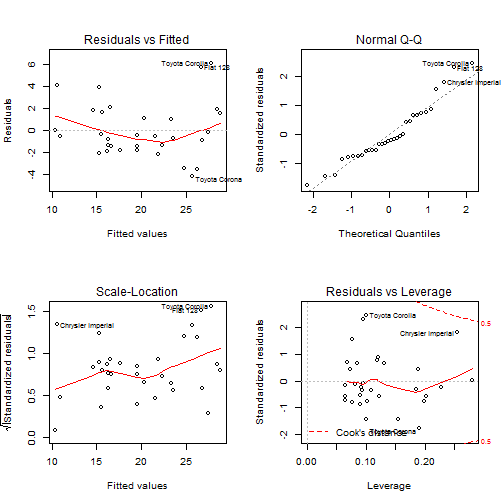

Difference between automatic and manual transmissions presentation
========================================================
author: Voronov Kirill
date: 07.07.2016

Summary
========================================================

This work tries to exploring the relationship between a set of variables in data set of a collection of cars (`mtcars`) and miles per gallon (`mtcars$mpg`). We are particularly interested in the following two questions:

* Is an automatic or manual transmission better for MPG?

* Quantify the MPG difference between automatic and manual transmissions

Documentation
========================================================

Fit a linear model for *MPG* compared to *Number of cylinders* and *Weight* with transmission as a factor 


```
              Estimate Std. Error    t value     Pr(>|t|)
(Intercept) 39.4179334  2.6414573 14.9227979 7.424998e-15
cyl         -1.5102457  0.4222792 -3.5764148 1.291605e-03
wt          -3.1251422  0.9108827 -3.4308942 1.885894e-03
am           0.1764932  1.3044515  0.1353007 8.933421e-01
```

Residual and diagnostic plots
========================================================

We do not see any systematic patterns, so it is possible to continue the analysis



Shiny Application
========================================================
Using our application the user can:
* plot the ratios of different variables by selecting them for each of the axes
* predict fuel consumption putting in the appropriate fields of the UI type of transmission, number of cylinders and weight of the vehicle

